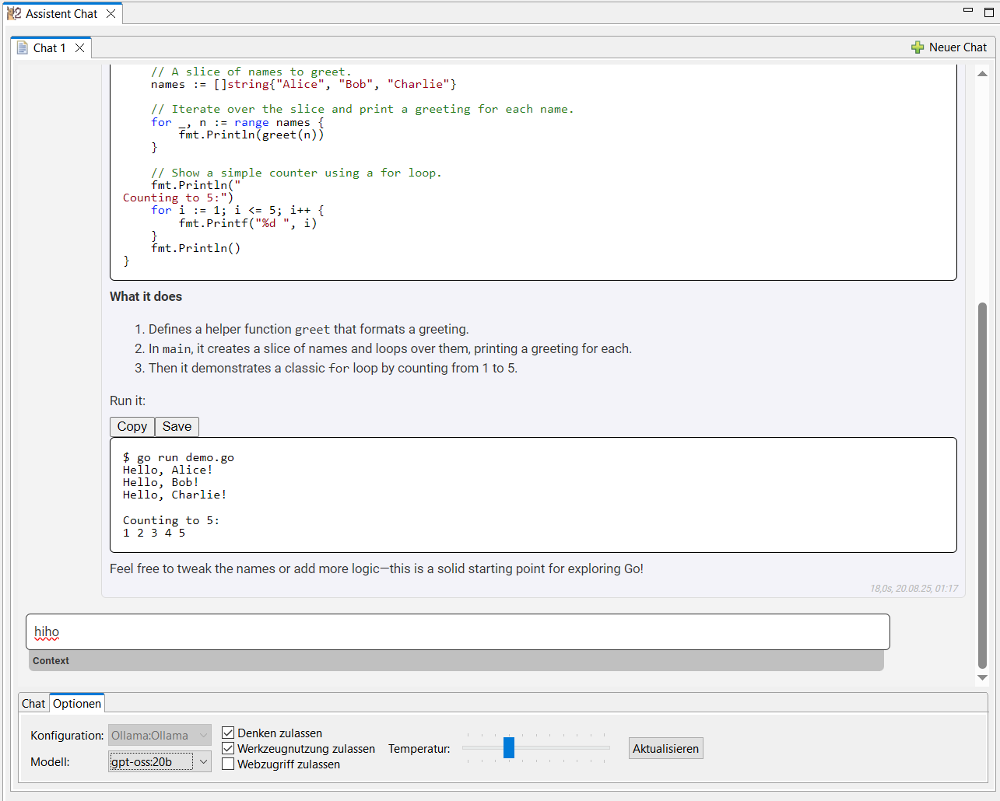

# EclipseAI - a AssistAI fork

This was initial a fork of [AssistAI](https://github.com/gradusnikov/eclipse-chatgpt-plugin) with focus on Ollama usage with some features found on the net.
It makes heavy usage of the langchain4j library for model interaction.

It is an Eclipse IDE plugin that brings a Large Language Model (LLM) assistant into your development environment.

## Features

- Engage in a conversation with LLM about the content of the currently opened file
- Copy code blocks generated by LLM to the clipboard
- Customize pre-defined prompts
- Using the function call feature EclipseAI can:
  - use JavaDoc or related source code to better understand the context
  - perform a web search using [DuckDuckGo](https://duckduckgo.com/) (selectable per query)
  - read a content of a web page
- Create contexts for the LLM that include source files
- Switch between defined LLMs

You can also pose general questions to LLM, just like with the regular Ollama interface.

## Installation

### Plugin Installation

Right now you have to checkout the repository via eclipse and build it yourself.

### Configuration

After installing the plugin, configure access to the **EclipseAI** panel inside the general preferences.

### Add ChatGPT View

Add the *AI Assistent Chat* to your IDE:

1. Open *Window > Show View > Other*
2. Select *AI Assistent Chat* from the *EclipseAI* category

