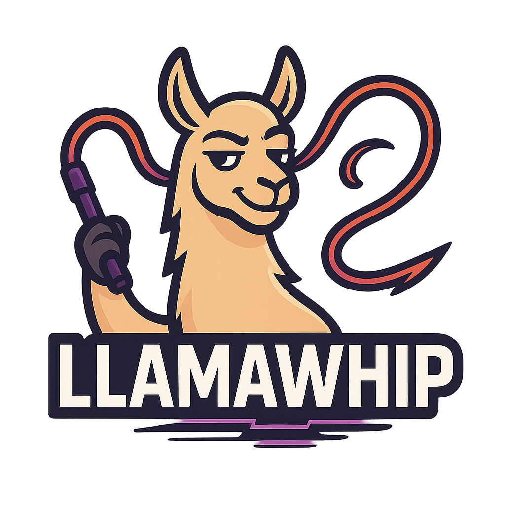

# LlamaWhip

This was initial a fork of [AssistAI](https://github.com/gradusnikov/eclipse-chatgpt-plugin) with focus on OnPremise usage, so Ollama/LocalAI/JLama are the primary supported backends - but other cloud providers will be supported as well (ChatGPT and Copilot are in alpha (Alpaca?) stage) with some features found on the net. It makes heavy usage of the [langchain4j](https://docs.langchain4j.dev) library for model interaction, so most of their supported providers would be a option in the future.

The plugin brings you a `Large Language Model (LLM)` assistant into your Eclipse IDE.

_Why that name? There are many llamas in the AI world, a whip is used to make animals to do what you want, and according to some companies it is good practice to whip llamas *** ... ;-) _

## Features

- Engage in multiple conversations with different LLM about the content of the currently opened files
- In-editor prompt to generate specific code at current cursor location
- Copy/save code generated blocks to the clipboard
- Customize pre-defined prompts
- Using the function call feature LlamaWhip can:
  - use related source code to better understand the context
  - perform a web search using (selectable per query) 
  - read a content of a web pag
  - open new file/compare editor
- Create contexts for the LLM that include source files
- Switch between defined LLMs per request

You can also pose general questions to LLM, just like with the regular LLM interfaces.

| Provider    | Support  |
|-------------|----------|
| Ollama      | Working  |
| JLama       | Preview  |
| LocalAI     | InDev    |
| GitHub      | Planning |
| ChatGPT     | Planning |

## Installation

### PlugIn Installation

Download the release and extract it in your %ECLIPSE%/dropins folder. Marketplace will be done when the
plugin is kind of code stable.  

### Configuration

After installing the plugin, configure access to the **LlamaWhip** panel inside the general preferences.

### Add Chat View

Add the *LlamaWhip Chat* to your IDE:

1. Open *Window > Show View > Other*
2. Select *Assistent Chat* from the *LlamaWhip* category

### Other features

Press CTRL-ALT-A to open a small inline code generation prompt

Press "Attach" in the chat window or drop files on the button to add them to your message (do not add too many/too big, they will be added to the chat request directly)

 